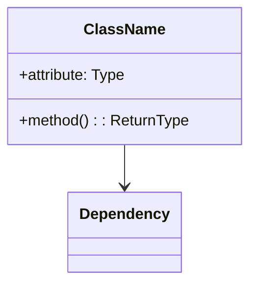
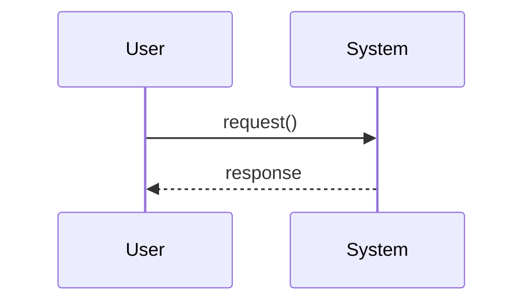
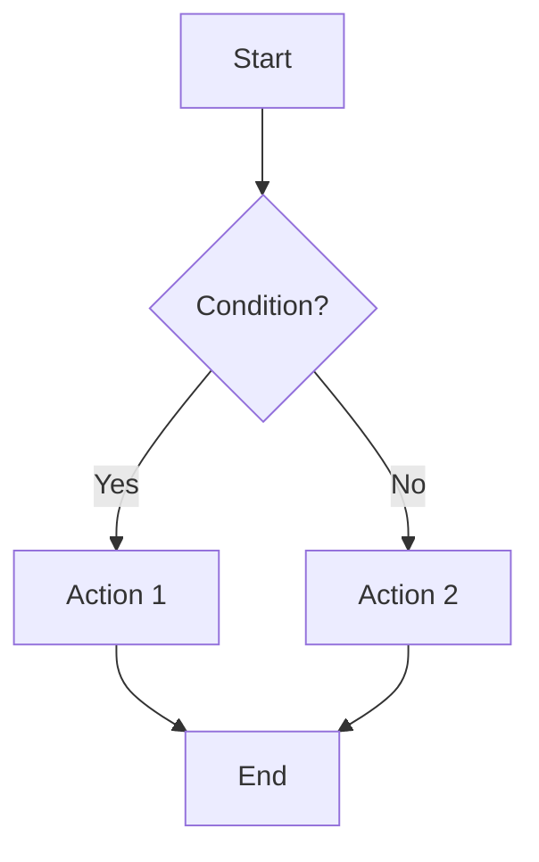

# Code Explainer

Understand code architecture, patterns, and flow.

## Overview

This skill helps you understand code by generating clear explanations, identifying design patterns, and creating visual diagrams. Uses a Socratic approach to guide users toward discovering what they need to understand.

## Execution Steps

### 1. Check for IDE Selection (IMPORTANT - Do This First!)

**Before asking any questions**, check if the user has code selected in their IDE:

- If `<ide_selection>` tags are present in the conversation, **immediately explain that code** without asking questions
- If no selection is present, proceed to step 2

When IDE selection is detected:

1. Read the full file for context (if not already visible)
2. Analyze the selected code
3. Generate explanation immediately
4. Skip the discovery steps entirely

### 2. Socratic Discovery Process (No Selection Present)

Use a guided question approach to help users discover what they actually need explained. This is more effective than asking "what do you want?" because users often don't know exactly what they need until they explore.

#### Step 2a: Understand the User's Goal

Use AskUserQuestion to understand WHY they need an explanation:

```yaml
Question 1:
  header: "Goal"
  question: "What are you trying to accomplish?"
  options:
    - label: "Debug an issue"
      description: "Something isn't working and I need to understand why"
    - label: "Add a feature"
      description: "I need to modify or extend existing code"
    - label: "Learn the codebase"
      description: "I'm new and want to understand how things work"
    - label: "Review or refactor"
      description: "I want to improve or evaluate code quality"
```

#### Step 2b: Narrow Down the Area

Based on their goal, ask a follow-up question:

```yaml
# If "Debug an issue":
Question:
  header: "Problem area"
  question: "Where are you seeing the problem?"
  options:
    - label: "I see an error message"
      description: "There's a specific error or exception"
    - label: "Wrong behavior"
      description: "Code runs but doesn't do what I expect"
    - label: "Not sure where"
      description: "I need help finding the relevant code"

# If "Add a feature":
Question:
  header: "Feature type"
  question: "What kind of change are you making?"
  options:
    - label: "New endpoint/API"
      description: "Adding new functionality"
    - label: "Modify existing behavior"
      description: "Changing how something works"
    - label: "Integration"
      description: "Connecting to another system or module"

# If "Learn the codebase":
Question:
  header: "Learning focus"
  question: "What aspect interests you most?"
  options:
    - label: "Overall structure"
      description: "How is the project organized?"
    - label: "Core concepts"
      description: "What are the main abstractions?"
    - label: "Data flow"
      description: "How does information move through the system?"
    - label: "Specific module"
      description: "I want to understand one part deeply"

# If "Review or refactor":
Question:
  header: "Review focus"
  question: "What are you evaluating?"
  options:
    - label: "Code quality"
      description: "Is this well-written and maintainable?"
    - label: "Performance"
      description: "Could this be more efficient?"
    - label: "Security"
      description: "Are there potential vulnerabilities?"
    - label: "Design patterns"
      description: "Is this using appropriate patterns?"
```

#### Step 2c: Get Specifics

Based on previous answers, either:

- Use Glob/Grep to find relevant files and present options
- Ask for a specific file path or function name
- Suggest starting points based on their goal

```yaml
# Example for "Not sure where":
Question:
  header: "Clues"
  question: "What clues do you have about the problem?"
  options:
    - label: "Error message text"
      description: "I can share the error"
    - label: "Feature name"
      description: "I know what feature is broken"
    - label: "File or function name"
      description: "I have a partial name"
    - label: "Symptoms only"
      description: "I can only describe what's happening"
```

#### Step 2d: Confirm Understanding

Before diving in, briefly summarize what you'll explain and confirm:

"Based on your answers, I'll explain [X] to help you [goal]. Does that sound right?"

This gives the user a chance to course-correct before you invest in a detailed explanation.

### 3. Read and Analyze the Code

Use the Read tool (not bash cat) to read files:

For a file:

- Read the target file directly

For a module:

- Use Glob to find Python files in the module
- Read **init**.py for public API
- Read key implementation files

For architecture:

- Explore the src/ directory structure
- Identify main entry points
- Map dependencies between modules

### 4. Generate Explanation

Structure based on what's being analyzed:

#### For Functions

1. **Purpose**: What does it do?
2. **Parameters**: What inputs does it take?
3. **Return value**: What does it output?
4. **Side effects**: Does it modify state?
5. **Example usage**: How to call it

#### For Classes

1. **Responsibility**: What is this class for?
2. **Key attributes**: Important state
3. **Key methods**: Important behaviors
4. **Relationships**: Parent classes, dependencies
5. **Design pattern**: Is it a Factory, Singleton, etc.?

#### For Modules

1. **Purpose**: What problem does it solve?
2. **Public API**: What can users import?
3. **Internal structure**: How is it organized?
4. **Dependencies**: What does it depend on?

#### For Architecture

1. **High-level overview**: What are the main components?
2. **Data flow**: How does data move through the system?
3. **Key abstractions**: What are the core concepts?
4. **Extension points**: How can it be customized?

### 5. Generate Diagrams (When Helpful)

Create Mermaid diagrams for visual understanding:

#### Class Diagram



#### Sequence Diagram



#### Flowchart



### 6. Identify Patterns

Look for and explain design patterns:

- **Creational**: Factory, Builder, Singleton
- **Structural**: Adapter, Decorator, Facade
- **Behavioral**: Strategy, Observer, Command
- **Architectural**: MVC, Repository, CQRS

## Output Format

```markdown
## Code Explanation: [name]

### Summary

[One paragraph overview]

### Purpose

[What problem does this solve?]

### How It Works

[Step by step explanation]

### Key Components

- **ComponentA**: [description]
- **ComponentB**: [description]

### Design Patterns Used

- [Pattern]: [where and why]

### Diagram

[Mermaid diagram if applicable]

### Related Code

- [file:line](path/to/file.py#L42): [relationship]
```

## Explanation Depth Guidelines

### Quick Overview (Default)

- 2-3 paragraph summary
- Bullet points for key components
- One diagram if helpful
- ~200-400 words

### Detailed Breakdown

- Full analysis of each component
- Multiple diagrams
- Code examples
- Trade-off discussion
- ~500-1000 words

### Beginner-Friendly

- Use simple analogies
- Avoid jargon or explain it
- Focus on "what" not "how"
- Include more examples
- ~300-500 words

## Related Commands

- `/review` - Code review with standards checking
- `/debug` - Investigate bugs
- `/profile` - Performance analysis
